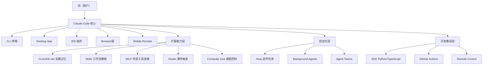

# 第一章：认识 Claude Code

# 认识 Claude Code 🟢

> **核心问题**：Claude Code 到底是什么？和其他 AI 工具有什么本质区别？
> 

---

## 1.1 不只是代码助手——Claude Code 的真实定位

很多人第一次听到「Claude Code」，以为它只是个更好用的代码补全工具。

**这个理解是错的。**

Claude Code 是一个运行在你终端里的 **通用 AI Agent**。它不是在对话框里回答问题——它可以**直接行动**：

- 📁 读取、创建、修改你的文件
- 💻 执行 shell 命令和脚本
- 🌐 搜索网络获取最新信息
- 🖥️ 直接操控你的桌面（Computer Use，2026年新功能）
- 🔗 连接数据库、API、外部服务（通过 MCP）
- 🤖 派生多个子 Agent 并行工作
- ⏱️ 定时自动执行任务（`/loop`）

**一句话理解**：Claude Code 是一个住在你电脑里、能自主行动的超级助手。

### 对话型 AI vs Agent 型 AI

| **维度** | **对话型 AI（如 ChatGPT）** | **Agent 型 AI（Claude Code）** |
| --- | --- | --- |
| 工作方式 | 你问，它答 | 你下指令，它自主执行 |
| 能访问什么 | 只有你粘贴的内容 | 你的整个文件系统、命令行、外部工具 |
| 能做什么 | 生成文字、代码片段 | 直接修改文件、运行程序、提交代码 |
| 适合场景 | 咨询、学习、灵感 | 实际工作任务执行 |

---

## 1.2 五种使用入口（2026年最新）

Claude Code 不只是一个命令行工具，2026年已经拥有完整的多端生态：

### 🖥️ 终端 CLI（最灵活，开发者首选）

```bash
claude                    # 进入交互模式
claude -p "帮我分析这个文件"  # 单次执行
```

### 🪟 Desktop App（图形化界面，无需命令行）

- 内置文件浏览器、对话历史、Projects 管理
- 适合不习惯命令行的用户
- 支持 macOS / Windows / Linux

### 🔌 IDE 插件（VS Code / JetBrains 内嵌）

- 直接在编辑器内调用，不需要切换窗口
- 支持代码选中后右键 → 「Ask Claude」

### 🌐 Browser 版（无需安装）

- 打开浏览器直接使用
- 适合临时使用或在没有安装环境的电脑上

### 📱 Mobile Remote Control（2026年新功能）

- 手机 App 远程控制本地 Claude Code
- 出门在外，用手机下达任务，电脑在家执行
- 适合「下班路上布置任务，到家已经完成」的工作流

---

## 1.3 生态全景图（v2.1.84 版）



### 核心模型（2026年2月最新）

| 模型 | 定位 | 适合场景 |
| --- | --- | --- |
| **Claude Opus 4.6** | 最强，最慢 | 复杂架构、高难度任务 |
| **Claude Sonnet 4.6** | 均衡，默认 | 日常编码、文档处理 |
| **Claude Haiku 4.5** | 最快，最省 | 简单任务、子Agent |

---

## 1.4 与同类工具对比

| **工具** | **类型** | **核心优势** | **局限** |
| --- | --- | --- | --- |
| **Claude Code** | 终端Agent | 最强自主性、完整生态、国产模型兼容 | 需要适应命令行（有Desktop App缓解） |
| **Cursor / Windsurf** | IDE插件 | 代码补全体验极佳、Tab键补全 | 局限在编辑器内，自主性弱 |
| **Codex CLI** | 终端Agent | OpenAI生态集成、GPT-5驱动 | 生态不如Claude Code成熟 |
| **Gemini CLI** | 终端Agent | 免费额度慷慨（1M token/天） | 国内访问受限，生态较新 |

**Claude Code 的核心差异化**：

- ✅ 最完整的 Agent 生态（MCP + Skills + Hooks + Computer Use）
- ✅ 支持接入所有国产主流大模型（国内用户关键优势）
- ✅ 开放的 SDK，可嵌入自己的应用
- ✅ Agent Teams + Background Agents 真正的多Agent协作

---

## 1.5 订阅方案与费用

### 官方订阅（需境外支付）

| 方案 | 月费 | 主要区别 |
| --- | --- | --- |
| **Pro** | $20/月 | [Claude.ai](http://Claude.ai) 5倍用量，有限 Claude Code 使用 |
| **Max** | $100/月 | Claude Code 无限制使用，5倍更多使用量 |
| **Team** | $30/人/月 | 团队协作功能，共享工作空间 |
| **Enterprise** | 定制 | 私有部署、SSO、合规审计 |

### API Key 方式（推荐国内用户）

- 申请各厂商 API Key（DeepSeek / Kimi / Qwen 等）
- 配置到 Claude Code 使用国产模型
- **按量付费，成本极低，无需境外信用卡**
- 详细配置见第三章

### Token 成本估算（以 DeepSeek V3.2 为例）

- 日常开发任务：约 ¥0.5～2 元/小时
- 大型代码重构：约 ¥5～20 元/次
- 比官方订阅省 **90%+** 的费用

---

## 🔬 实战案例

### 案例1：10分钟用 Claude Code 完成竞品分析

```bash
# 进入 Claude Code
claude

# 输入任务
帮我调研「AI代码助手」市场的前5名竞品，
包括：产品定位、核心功能、定价、优缺点。
最后生成一份 Markdown 格式的竞品分析报告，
保存到 competitor-analysis.md
```

Claude Code 会自动：搜索网络 → 整理信息 → 写成文档 → 保存文件。

### 案例2：批量处理30个Excel表格

```bash
claude -p "
当前目录下有30个名为 report_*.xlsx 的文件。
请：
1. 读取每个文件的第一个Sheet
2. 提取'销售额'和'利润'两列数据
3. 汇总到一个新的 summary.xlsx 文件
4. 同时生成一个趋势折线图 summary_chart.png
"
```

---

<aside>
💡

**小结**：Claude Code 不是对话工具，是行动工具。掌握它的关键不是学会「怎么问」，而是学会「怎么指挥」。接下来，我们先把它装到电脑上。

</aside>

---

<aside>
⬅️

[← 上一章：写在前面](%E7%AC%AC%E3%80%87%E7%AB%A0%EF%BC%9A%E5%86%99%E5%9C%A8%E5%89%8D%E9%9D%A2%2024423393d6054092ba6f770e8f21a514.md)

</aside>

<aside>
➡️

[下一章：安装与初始配置 →](%E7%AC%AC%E4%BA%8C%E7%AB%A0%EF%BC%9A%E5%AE%89%E8%A3%85%E4%B8%8E%E5%88%9D%E5%A7%8B%E9%85%8D%E7%BD%AE%20957d2aaf00284da08b90405ccf427ce2.md)

</aside>